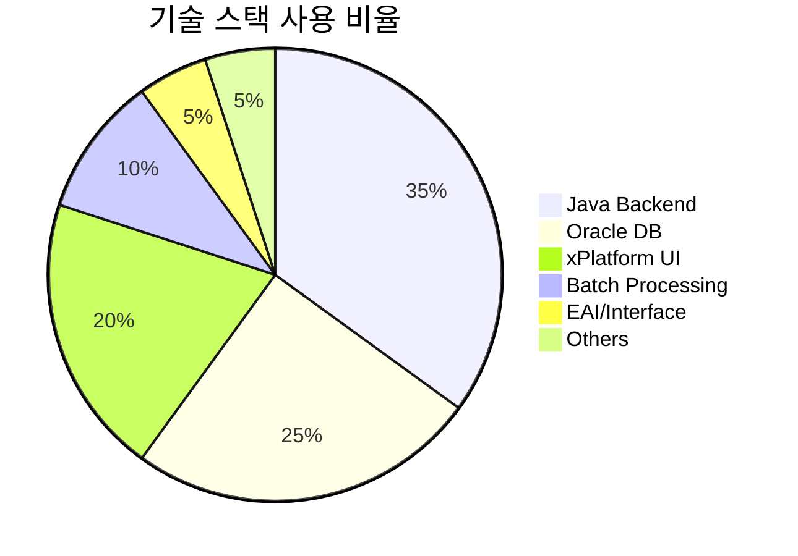

## 📊 🚀 토비라이프의 경력 Overview

### 전체 경력 마인드맵

```mermaid
    메리츠화재 기간계(2009-2013)
      대외계 운영
        FEP Batch
        Anylink/Cruzlink
      계약공통 개발
        마감배치관리
        RC 유의고객
        채권가압류
      공통개발
        DBIO 모듈
        MCC 테이블설계
      고객센터 시스템
        이관업무
        원격지요청
      FP민원시스템
      🏆 2012 운영 최우수상
      🏆 2013 매뉴얼 최우수상
    현대해상 비대면채널 CM(2017-2022)
      CM자동차 청약
      장기 청약
      제휴 시스템
        이지세이브
        SKC&S
        청신호 앱
      장기 신상품
        주택화재
        사업장화재
        어린이/건강
      장기 고도화
    한화손해보험 비대면채널 CM(2022-현재)
      자동차보험 리뉴얼
      장기 고도화
        가입설계
        전자서명
        본인인증
        결제모듈
      원데이 자동차보험
```

## 💻 기술 스택 분포



## 🏢 회사별 주요 프로젝트

### 1. 메리츠화재 (2009.03 ~ 2013.09)

#### 🔧 기술 스택

* **Backend**: Java, Spring Framework
* **Frontend**: xPlatform
* **Database**: Oracle, DB2
* **Reporting**: Oz Report
* **Interface**: Anylink, Cruzlink

#### 📋 주요 프로젝트

:::tip\[대외계 운영 (FEP Batch)]
**개요**: 방카슈랑스, FB, CMS 이체, 수수료 등 대외계 전문 관리\
**기술**: Anylink, Cruzlink\
**성과**: 안정적인 대외계 인터페이스 운영으로 2012년 운영 최우수상 수상
:::

:::tip\[계약공통 개발]
**주요 모듈**:

* **고객센터 시스템**: 지점, 창구, 센터 관리 시스템 운영 및 유지보수
* **마감배치관리**: 이체, 관리회계, 수수료 등 주요 배치 스케줄 JOB 캘린더 VIEW 관리
* **RC 유의고객**: 보험 유의자 관리 시스템
* **채권가압류**: 법원 제공 채무자 정보 기반 가압류 여부 및 보험현황 관리
* **AML 자금세탁방지**: 화면 개발
* **출력물 고도화**: 레포트 전면 리뉴얼

**기술**: Java, Oracle, xPlatform, Oz Report
:::

:::tip\[DBIO 공통모듈]
**개요**: 개발환경 전체 IO관리 (온라인/배치) 모듈 관리 배포
**기술**: Java, MCC 테이블 설계 운영
**성과**: 개발 생산성 향상 및 표준화
:::

### 2. 현대해상 (2017.12 ~ 2022.09)

#### 🔧 기술 스택

* **Backend**: Java, Spring Boot
* **Frontend**: Jsp
* **Database**: Oracle

#### 📋 주요 프로젝트

:::important\[제휴 간편설계 시스템]
**구축 시스템**:

* 이지세이브 간편설계
* SKC&S 간편설계  
* 청신호 앱 간편설계
* 현대해상 다이렉트 이벤트

**기술**: Java, RESTful API, Oracle, Jsp, jquery
:::

:::important\[장기보험 신상품 개발]
**개발 상품**:

* 주택화재보험
* 사업장화재보험
* 어린이보험
* 건강보험
* 암보험
* 실손보험
* 운전자보험

**기술**: Java, Oracle, Jsp, jquery
:::

### 3. 한화손해보험 (2022.09 ~ 현재)

#### 🔧 기술 스택

* **Backend**: Java
* **Frontend**: jsp
* **Database**: Oracle
* **Integration**: EAI Service

#### 📋 주요 프로젝트

:::caution\[자동차보험 리뉴얼]
**개요**: 레거시 자동차보험 시스템 전면 리뉴얼\
**기술**: Java, jsp, jqeury, oracle
:::

:::caution\[장기보험 고도화]
**개발 모듈**:

* 가입설계 시스템
* 로그 개선
* 전자서명 모듈
* 본인인증 시스템
* 결제 모듈
* EAI 서비스 모듈

**기술**: Java, Spring Boot, EAI
:::

:::caution\[원데이 자동차보험]
**개요**: 단기 자동차보험 신규 서비스\
**주요 기능**: 가입설계, 취소배서\
**기술**: Java, jsp, oracle
:::

### 보험 시스템 아키텍처 이해

* **Core Insurance System**: 계약, 공통 업무
* **Channel System**: 대면/비대면 채널 통합
* **External Interface**: 금융기관, 공공기관 연계
* **Batch Processing**: 대용량 일괄 처리
* **Compliance**: 금융규제 준수 (AML, 개인정보보호)

## 🏆 주요 성과

* 15년간 3개 주요 손해보험사 핵심 시스템 구축/운영
* 레거시 시스템 현대화 및 신기술 도입 경험 (현대해상, 한화손해보험)

## 💡 기술적 강점

1. **보험 도메인 전문성**: 15년간 축적된 보험업 비즈니스 로직 이해
2. **Full-Stack 개발**: Backend(Java) + Frontend(xPlatform, React, jsp, vue, nextjs) + DB
3. **대용량 처리**: 보험사 배치 시스템 설계 및 최적화 경험
4. **시스템 통합**: 대외계 인터페이스 및 제휴사 연동 경험
5. **프로젝트 관리**: 신상품 개발부터 시스템 리뉴얼까지 다양한 규모 경험

- - -

> 💬 "보험은 복잡하지만, 기술로 단순하게 만들 수 있는 환경을 만들고 싶습니다." - 토비라이프
