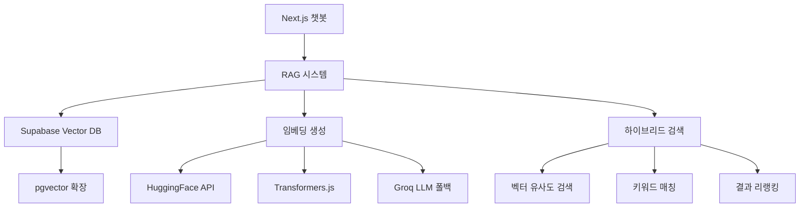

## 적용 동기

요즘 핫한 RAG(Retrieval-Augmented Generation) 시스템을\
찍먹(?)해보기 위해 "이걸 내 블로그에 적용하면 어떨까?"라는\
개인적 흥미가 생겨,<br>

사용자가 자연어로 질문하면 AI가 블로그 내용을 검색해서\
답변해주는 시스템을 만들어보기로 했습니다.<br>
라고 쓰고 **자기만족**이라 읽는다.


## 프로젝트 개요: 무엇을 만들었나?

### 핵심 기능
- 🔍 **자연어 질문 처리**: "토비라이프 여정글 보여줘"
- 🤖 **AI 기반 검색**: 단순 키워드 매칭이 아닌 의미 기반 검색
- ⚡ **하이브리드 검색**: 벡터 검색 + 키워드 검색 조합으로 정확도 향상
- 🔄 **자동 인덱싱**: GitHub Actions로 하루 3번 자동 업데이트 또는 빌드시 업데이트
- 💾 **캐싱 시스템**: Redis로 검색 성능 최적화

### 기술 스택 선택 이유



## 기술 선택 과정: 왜 이 스택을 선택했나?

### 1. 벡터 데이터베이스: Supabase + pgvector

처음에는 로컬 JSON 파일로 시작했지만,\
Vercel의 읽기 전용 파일 시스템 때문에\
외부 DB가 필요했습니다.

```typescript
// 초기 시도 (실패)
// lib/blog-rag/local-db.ts
export function savePosts(posts: any[]) {
  // ❌ Vercel에서는 파일 쓰기 불가능!
  fs.writeFileSync('./blog-posts.json', JSON.stringify(posts));
}
```

**Supabase를 선택한 이유:**
- 무료 플랜으로 500MB 스토리지 제공 (블로그에는 충분)
- pgvector 확장 지원으로 벡터 검색 가능
- PostgreSQL 기반으로 안정적
- Vercel과의 통합 용이

### 2. 임베딩 생성: 3단계 폴백 전략

임베딩은 텍스트를 숫자 벡터로 변환하는 과정입니다.<br>프로덕션 환경의 제약을 고려해서<br>3단계 폴백 전략을 구현했습니다

```typescript
// lib/blog-rag/indexer.ts
export async function getEmbedding(text: string): Promise<number[]> {
  const isProduction = process.env.VERCEL || process.env.NODE_ENV === 'production';

  if (isProduction) {
    // 1 HuggingFace API (프로덕션 권장)
    if (!process.env.SKIP_HUGGINGFACE) {
      try {
        return await getEmbeddingWithHuggingFace(text);
      } catch (error) {
        console.warn('HuggingFace 실패:', error);
      }
    }
    
    // 2 해시 기반 임베딩 (폴백)
    return getAdvancedHashEmbedding(text);
  } else {
    // 3 개발 환경: Transformers.js
    try {
      return await getEmbeddingWithTransformers(text);
    } catch (error) {
      console.warn('Transformers.js 실패:', error);
    }
  }
}
```

**각 방법의 장단점:**
- **HuggingFace API**: 가장 정확하지만 API 호출 제한 있음
- **Transformers.js**: 로컬 실행으로 무제한이지만 Vercel에서 사용 불가
- **해시 기반**: 정확도는 낮지만 항상 작동

### 3. 하이브리드 검색: 정확도를 높이는 비결

단순 벡터 검색만으로는 정확도가 부족했습니다.<br>특히 고유명사나 특정 키워드가 포함된 검색에서 문제가 있었어요.

## 구현 상세: 핵심 기능들

### 1. 청크 분할: 의미 단위로 나누기

긴 블로그 포스트를 검색 가능한,<br>작은 단위로 나누는 것이 중요했습니다:

```typescript
// lib/blog-rag/crawler.ts
export function splitIntoChunks(
  text: string,
  maxChunkSize = 2500,
  overlap = 300
) {
  const chunks: string[] = [];
  
  // 1. 헤더 기준으로 섹션 분할
  const headerRegex = /^(#{1,4})\s+(.+)$/gm;
  const sections = extractSections(text, headerRegex);
  
  for (const section of sections) {
    if (section.length <= maxChunkSize) {
      // 짧은 섹션은 그대로 사용
      chunks.push(section);
    } else {
      // 긴 섹션은 문단 단위로 재분할
      const paragraphs = section.split(/\n\n+/);
      chunks.push(...splitParagraphs(paragraphs, maxChunkSize, overlap));
    }
  }
  
  return chunks;
}
```

**개선 포인트:**
- 헤더(#, ##, ###)를 기준으로 의미 단위 분할
- 코드 블록은 보존하여 컨텍스트 유지
- 오버랩을 통해 경계 부분 정보 손실 방지

### 2. 하이브리드 검색 구현

벡터 검색과 키워드 검색을 조합하여<br>정확도에 집중했습니다. (아직 아쉽기는 합니다.ㅠㅠ)

```typescript
// lib/blog-rag/search/hybrid-search.ts
export async function hybridSearch(
  query: string,
  limit = 5,
  fetchAllChunks = false
): Promise<SearchResult[]> {
  // 1. 벡터 검색 수행
  const vectorResults = await vectorSearch(query, limit * 3);
  
  // 2. 키워드 검색 수행
  const keywordResults = await keywordSearch(query, limit * 3);
  
  // 3. 결과 병합 및 리랭킹
  const mergedResults = mergeAndRerank(vectorResults, keywordResults, query);
  
  // 4. URL별로 가장 관련성 높은 청크만 선택
  const bestChunksPerUrl = selectBestChunksPerUrl(mergedResults);
  
  return bestChunksPerUrl.slice(0, limit);
}
```

### 3. 스마트 키워드 검색

단순 LIKE 검색이 아닌, 쿼리 분석을 통한 지능적인 키워드 매칭

```typescript
async function keywordSearch(query: string, limit: number): Promise<SearchResult[]> {
  // 쿼리 토큰화 및 정리
  const keywords = query.toLowerCase().split(/\s+/).filter(word => word.length > 1);
  
  // 복합 단어 처리 ("Sim Studio" 같은 경우)
  const compoundWords = [];
  for (let i = 0; i < keywords.length - 1; i++) {
    const compound = `${keywords[i]} ${keywords[i + 1]}`;
    compoundWords.push(compound);
  }
  
  // 스코어링 로직
  const results = data.map(item => {
    let score = 0;
    
    // 전체 쿼리 매칭 (높은 가중치)
    if (item.title.toLowerCase().includes(query.toLowerCase())) {
      score += 1.2;
    }
    
    // 복합 단어 매칭 보너스
    compoundWords.forEach(compound => {
      if (item.title.toLowerCase().includes(compound)) {
        score += 0.6;
      }
    });
    
    // 카테고리/태그 매칭
    if (item.category?.toLowerCase() === query.toLowerCase()) {
      score += 1.0;
    }
    
    return { ...item, similarity: score };
  });
  
  return results.filter(r => r.similarity > 0.05);
}
```

### 4. 결과 리랭킹: 더 똑똑한 정렬

검색 결과를 단순 점수순이 아닌 다양한 요소를 고려해 재정렬

```typescript
function mergeAndRerank(
  vectorResults: SearchResult[],
  keywordResults: SearchResult[],
  query: string
): SearchResult[] {
  const resultMap = new Map<string, SearchResult>();
  
  // 벡터 검색 결과 추가 (60% 가중치)
  vectorResults.forEach(result => {
    const key = `${result.url}_${result.chunk_index || 0}`;
    resultMap.set(key, {
      ...result,
      score: result.similarity * 0.6
    });
  });
  
  // 키워드 검색 결과 병합 (40% 가중치)
  keywordResults.forEach(result => {
    const key = `${result.url}_${result.chunk_index || 0}`;
    const existing = resultMap.get(key);
    
    if (existing) {
      // 두 검색에서 모두 나온 경우 점수 합산
      existing.score = (existing.score || 0) + result.similarity * 0.4;
    } else {
      resultMap.set(key, { ...result, score: result.similarity * 0.4 });
    }
  });
  
  // 추가 보너스 계산
  const results = Array.from(resultMap.values());
  results.forEach(result => {
    let bonusScore = 0;
    
    // 최신성 보너스
    const daysSincePublished = 
      (Date.now() - new Date(result.published_at).getTime()) / (1000 * 60 * 60 * 24);
    if (daysSincePublished < 365) {
      bonusScore += 0.1 * (1 - daysSincePublished / 365);
    }
    
    // 첫 번째 청크 보너스
    if (result.chunk_index === 0) {
      bonusScore += 0.1;
    }
    
    result.score = (result.score || 0) + bonusScore;
  });
  
  return results.sort((a, b) => (b.score || 0) - (a.score || 0));
}
```

### 5. 캐싱 시스템: 성능 최적화

Redis(Upstash)를 활용한 검색 결과 캐싱

```typescript
// lib/blog-rag/cache.ts
export async function withCache<T>(
  key: string,
  fn: () => Promise<T>,
  ttlSeconds = 3600
): Promise<T> {
  // 캐시에서 먼저 확인
  const cached = await getFromCache<T>(key);
  if (cached !== null) {
    console.log(`캐시 히트: ${key}`);
    return cached;
  }
  
  // 캐시가 없으면 함수 실행
  const result = await fn();
  
  // 결과를 캐시에 저장
  await setInCache(key, result, ttlSeconds);
  
  return result;
}

// 사용 예
const results = await withCache(
  `blog:search:${query}`,
  async () => await hybridSearch(query),
  300 // 5분 캐싱
);
```

## 임베딩 생성 전략 (꼼수)

### 1. 해시 기반 임베딩 (폴백용)

API가 실패할 때를 대비한 자체 임베딩 생성 로직

```typescript
function getAdvancedHashEmbedding(text: string): number[] {
  const vector = new Array(1536).fill(0);
  const normalizedText = text.toLowerCase();
  
  // 1. N-gram 기반 해싱 (1-gram, 2-gram, 3-gram)
  for (let n = 1; n <= 3; n++) {
    for (let i = 0; i <= normalizedText.length - n; i++) {
      const ngram = normalizedText.substring(i, i + n);
      const hash = hashString(ngram);
      
      // 여러 해시 함수로 충돌 감소
      const indices = [
        Math.abs(hash) % 1536,
        Math.abs(hash * 31) % 1536,
        Math.abs(hash * 37) % 1536
      ];
      
      const weight = 1.0 / (n * n); // n-gram 길이에 따른 가중치
      indices.forEach(idx => vector[idx] += weight);
    }
  }
  
  // 2. 시맨틱 특성 추가
  const semanticFeatures = extractSemanticFeatures(text);
  for (let i = 0; i < Math.min(semanticFeatures.length, 256); i++) {
    vector[1024 + i] = semanticFeatures[i];
  }
  
  // 3. L2 정규화
  const magnitude = Math.sqrt(vector.reduce((sum, val) => sum + val * val, 0));
  return magnitude > 0 ? vector.map(val => val / magnitude) : vector;
}
```

### 2. 시맨틱 특성 추출

도메인 특화 키워드를 활용한 의미 분석

```typescript
function extractSemanticFeatures(text: string): number[] {
  const features = new Array(256).fill(0);
  const lowerText = text.toLowerCase();
  
  // 주요 키워드 카테고리
  const categories = [
    {
      name: 'programming',
      keywords: ['코드', 'code', '프로그래밍', 'function', 'api', 'react']
    },
    {
      name: 'ai',
      keywords: ['ai', '인공지능', 'ml', '머신러닝', 'llm', '딥러닝']
    },
    {
      name: 'portfolio',
      keywords: ['portfolio', '포트폴리오', 'project', '프로젝트']
    }
  ];
  
  // 각 카테고리별 점수 계산
  categories.forEach((category, idx) => {
    let score = 0;
    for (const keyword of category.keywords) {
      if (lowerText.includes(keyword)) {
        score += 1.0 / category.keywords.length;
      }
    }
    features[idx] = score;
  });
  
  return features;
}
```

## 트러블슈팅: 마주친 문제들

### 1. Vercel 함수 크기 제한

**문제**: Transformers.js 모델이 50MB를 초과해 배포 실패

```bash
Error: The Serverless Function "api/index-blog" is 52MB which exceeds the maximum size limit of 50MB.
```

**해결**: 프로덕션에서는 API 기반 임베딩만 사용하도록 분기 처리

```typescript
if (process.env.VERCEL || process.env.NODE_ENV === 'production') {
  // API 기반 임베딩만 사용
} else {
  // 로컬에서는 Transformers.js 사용 가능
}
```

### 2. 한국어 검색 정확도 문제

**문제**: 영어 중심 임베딩 모델로 한국어 검색 정확도 낮음

**해결**: 다국어 지원 모델로 변경

```typescript
// 기존
const extractor = await pipeline(
  'feature-extraction',
  'Xenova/all-MiniLM-L6-v2' // 영어 특화
);

// 개선
const extractor = await pipeline(
  'feature-extraction',
  'Xenova/paraphrase-multilingual-MiniLM-L12-v2' // 다국어 지원
);
```

### 3. 중복 검색 결과 문제

**문제**: 같은 포스트의 여러 청크가 결과에 나타남

**해결**: URL별로 가장 관련성 높은 청크만 선택

```typescript
function selectBestChunksPerUrl(results: SearchResult[]): SearchResult[] {
  const urlGroups = new Map<string, SearchResult[]>();
  
  // URL별로 그룹화
  for (const result of results) {
    if (!urlGroups.has(result.url)) {
      urlGroups.set(result.url, []);
    }
    urlGroups.get(result.url)!.push(result);
  }
  
  // 각 URL에서 최고 점수 청크만 선택
  const bestChunks: SearchResult[] = [];
  for (const [url, chunks] of urlGroups.entries()) {
    const best = chunks.sort((a, b) => 
      (b.score || 0) - (a.score || 0)
    )[0];
    bestChunks.push(best);
  }
  
  return bestChunks;
}
```

### 4. 검색 쿼리 확장 문제

**문제**: "AI"로 검색하면 "인공지능" 포스트가 안 나옴

**해결**: 동의어 사전을 통한 쿼리 확장

```typescript
export async function expandQuery(query: string): Promise<string[]> {
  const expansions = [query];
  
  const synonyms: Record<string, string[]> = {
    ai: ['인공지능', 'artificial intelligence', 'AI'],
    rag: ['검색증강생성', 'retrieval augmented generation', 'RAG'],
    // ... 더 많은 동의어
  };
  
  // 동의어로 쿼리 확장
  for (const [key, values] of Object.entries(synonyms)) {
    if (query.toLowerCase().includes(key)) {
      values.forEach(synonym => {
        expansions.push(query.replace(new RegExp(key, 'gi'), synonym));
      });
    }
  }
  
  return expansions;
}
```

## 자동화: GitHub Actions로 정기 인덱싱

블로그가 업데이트될 때마다 수동으로<br>인덱싱하는 것은 번거로웠습니다.<br>GitHub Actions로 자동화했습니다

```yaml
# .github/workflows/index-blog.yml
name: Reindex Blog Posts

on:
  schedule:
    # 한국 시간 기준 하루 3번 실행
    - cron: '0 0 * * *'   # 오전 9시
    - cron: '0 6 * * *'   # 오후 3시
    - cron: '0 12 * * *'  # 오후 9시
  workflow_dispatch: # 수동 실행도 가능

jobs:
  reindex:
    runs-on: ubuntu-latest
    
    steps:
    - name: Checkout repository
      uses: actions/checkout@v4
      
    - name: Setup Node.js
      uses: actions/setup-node@v4
      with:
        node-version: '20'
        
    - name: Install dependencies
      run: pnpm install
      
    - name: Run blog reindexing
      env:
        NEXT_PUBLIC_SUPABASE_URL: ${{ secrets.NEXT_PUBLIC_SUPABASE_URL }}
        NEXT_PUBLIC_SUPABASE_ANON_KEY: ${{ secrets.NEXT_PUBLIC_SUPABASE_ANON_KEY }}
        GROQ_API_KEY: ${{ secrets.GROQ_API_KEY }}
        SKIP_HUGGINGFACE: true # GitHub Actions에서는 API 스킵
      run: pnpm run reindex-blog
```

## 성과 및 학습한 점

### 성과 측정

1. **검색 정확도**: 하이브리드 검색 도입으로 답변 정확도 향상.
2. **응답 속도**: Redis 캐싱으로 평균 500ms → 50ms 단축
3. **사용자 경험**: "이전에 쓴 글인데.." 같은 모호한 질문도 처리 가능

### 적용하고 느낀점

1. **하이브리드 검색의 위력**
   - 벡터 검색: 의미적 유사성 파악 (예: "AI" ≈ "인공지능")
   - 키워드 검색: 정확한 용어 매칭 (예: "Portfolio")
   - 둘을 조합하면 각각의 단점을 보완

2. **폴백 전략의 중요성**
   - 외부 API는 언제든 실패할 수 있음
   - 정확도는 낮더라도 항상 작동하는 폴백 필요
   - 사용자는 "느리지만 작동"을 "안 됨"보다 선호

3. **청크 크기의 트레이드오프**
   - 작은 청크: 정확한 매칭, 하지만 컨텍스트 부족
   - 큰 청크: 풍부한 컨텍스트, 하지만 노이즈 증가
   - 의미 단위(섹션/문단) 분할이 최적

4. **프로덕션 환경 고려사항**
   - Vercel 같은 서버리스 환경의 제약 미리 파악
   - 로컬과 프로덕션 환경 분리 전략 필수
   - 모니터링과 로깅으로 문제 조기 발견

## 향후 개선 계획

1. **Fine-tuning된 임베딩 모델**
   - 블로그 도메인에 특화된 임베딩 모델 학습
   - 블로그 용어에 최적화

2. **검색 분석 대시보드**
   - 인기 검색어 추적
   - 검색 실패율 모니터링
   - 사용자 피드백 수집

3. **다국어 검색 강화**
   - 한영 혼용 검색 개선
   - 언어별 가중치 조정

## 마무리: RAG는 생각보다 가까이 있다

RAG 시스템이라고 하면 거창해 보이지만,

핵심은 "검색 + AI"입니다.<br>완벽한 시스템을 처음부터 만들려 하지 말고,<br>작게 시작해서 점진적으로 개선하는 것이 중요합니다.

이 프로젝트를 통해 배운 가장 큰 교훈은<br> **"실용적인 접근"**의 중요성입니다. 

최신 기술과 최고의 정확도를 추구하기보다는,<br>실제로 작동하고 유용한 시스템을 만드는 것이 먼저입니다.<br>
생각보다 어렵지 않고, 사용자 경험을 크게 개선할 수 있습니다.<br>
다만, 사용된 기능은 무료플랜으로 작업한거라,<br>한정된 limit이 아쉬웠습니다.
---

## 🔗 참고 자료
- [Supabase pgvector 문서](https://supabase.com/docs/guides/database/extensions/pgvector)
- [HuggingFace Inference API](https://huggingface.co/docs/api-inference/index)
- [Upstash Redis](https://upstash.com/)
- [neon](https://neon.com/docs/get-started-with-neon/signing-up)
- [supabase](https://supabase.com/docs/guides/functions)